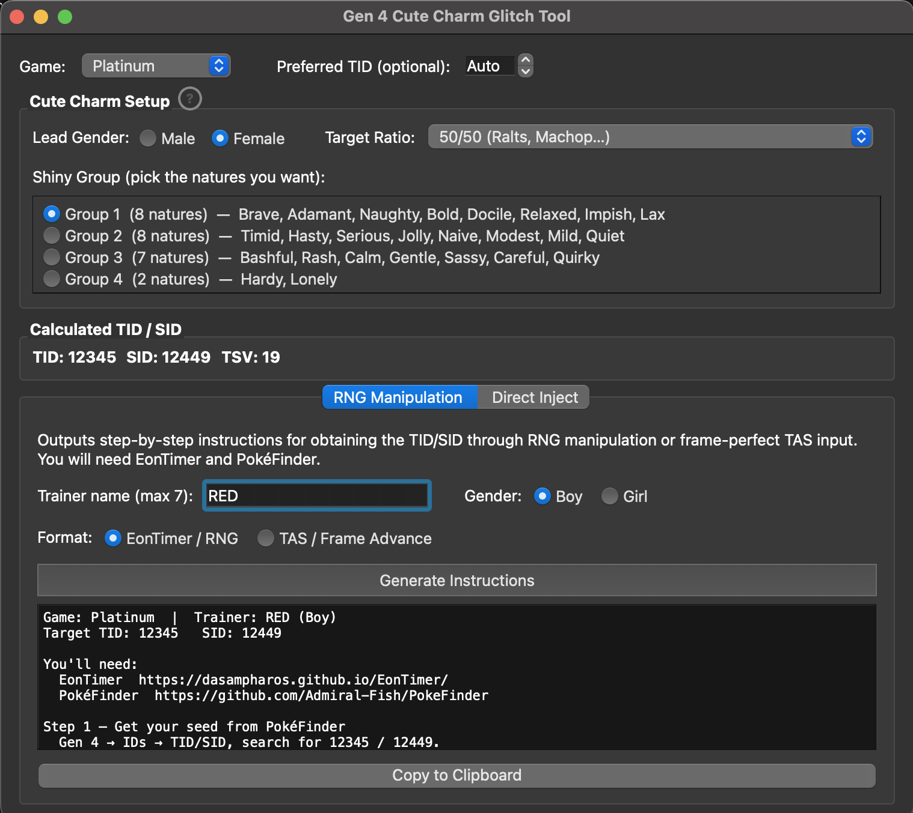

# Gen 4 Cute Charm Glitch Tool



A tool for setting up the [Cute Charm shiny glitch](https://github.com/mattyding/cute-charm/blob/main/ui/info_dialog.py) in Gen 4 (DPPt / HGSS). Calculates the TID/SID you need and either patches it directly into a save file or generates RNG manipulation instructions to obtain it legitimately.

Two modes:

- **RNG Manipulation** — EonTimer settings and step-by-step instructions for obtaining the TID/SID legitimately; includes a TAS / frame-advance output option
- **Direct Inject** — patches TID/SID directly into an existing save file and recalculates checksums

## Setup

```
pip install -r requirements.txt
python main.py
```

## Download

Pre-built binaries are available on the [Releases](../../releases) page.

To build from source on any platform:

```
pip install pyinstaller
pyinstaller build.spec
```

Output lands in `dist/`.

## Usage

1. Select your game and pick a shiny group (the set of natures you want to be shiny)
2. Choose a tab depending on how you want to obtain the TID/SID

**Direct Inject:** needs a `.sav` from the start of the game — create a new save, reach the first save point, then provide that file. TID/SID are patched in; trainer name and gender are preserved from the original save.

**RNG Manipulation:** enter your trainer name and gender, pick EonTimer or TAS output format, and follow the generated instructions.

## Legitimacy

Direct injection writes TID/SID directly into the save file. The RNG manipulation and TAS tabs provide instructions for obtaining the same IDs through in-game timing, which is the method accepted by the Pokémon RNG community.

## License

This project is MIT licensed. It depends on [PyQt6](https://www.riverbankcomputing.com/software/pyqt/), which is GPL v3 licensed. Bundled binary distributions therefore carry GPL v3 terms; the source code itself remains MIT.

## Credits

Save file patching logic ported from [PKHeX](https://github.com/kwsch/PKHeX) (MIT) by Kurt (kwsch).
RNG math references: [Smogon DPPt/HGSS RNG guides](https://www.smogon.com/ingame/rng/dpphgss_rng_part5), [PokémonRNG.com](https://www.pokemonrng.com/dppt-cute-charm/), [CuteCharmIDGenie](https://github.com/RenegadeRaven/CuteCharmIDGenie).

## Legal

This tool does not include or distribute any game files (ROMs, save data, or other copyrighted assets). You must own a legitimate copy of the game to use it.

Emulators are generally considered legal in most jurisdictions. The legality of ROM usage depends on your local laws and is your own responsibility.

Not affiliated with Nintendo, Game Freak, Creatures Inc., or The Pokémon Company. All Pokémon names and related properties are trademarks of their respective owners.
